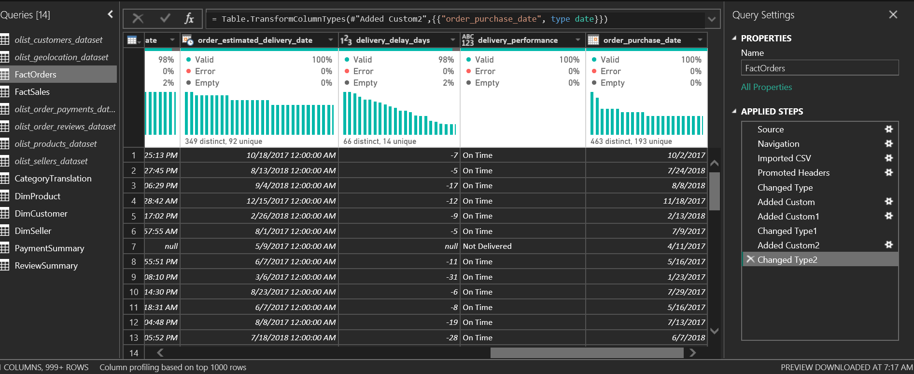
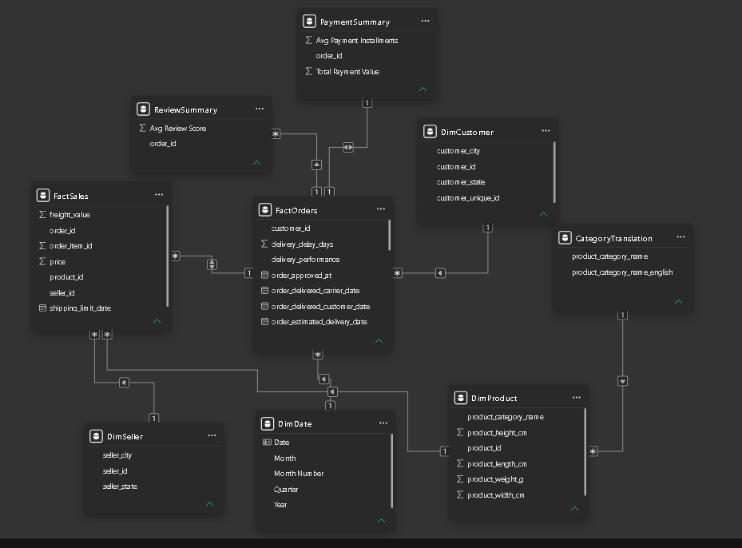

# DSA 3050A US 2026 – Business Intelligence & Data Visualization
## End Semester Practical Examination

**Student Name:** Paul Mbuvi
**Registration Number:** 669984
**Course:** DSA 3050A – Business Intelligence & Data Visualization
**Tool:** Microsoft Power BI Desktop

---

## 1. Project Overview

This project develops an interactive Business Intelligence solution using Power BI to analyze e-commerce sales, orders, customers, products, sellers, delivery performance, customer reviews and payments on the Olist Brazilian e-commerce marketplace.

The project follows the BI development process:

**Dataset → Power Query → Data Model → DAX → Dashboard → Business Insights**

The objective is to transform raw e-commerce data into an interactive analytical solution that supports business decision-making.

---

## 2. Dataset

### 2.1 Source

**Source:** https://www.kaggle.com/datasets/olistbr/brazilian-ecommerce

### 2.2 What the Dataset Represents

<!-- TODO: Paul — write 2-3 sentences in your own words describing what the Olist dataset covers (orders, customers, sellers, products, payments, reviews, 2016-2018, Brazilian marketplace) -->

### 2.3 Why This Dataset Was Selected

<!-- TODO: Paul — explain in your own words why you picked this dataset. Note: it should satisfy the rubric requirement of >20,000 records, multiple numerical/categorical variables, date/time data, and KPI-suitable variables — mention which ones. -->

### 2.4 Main Variables

The main tables used in the analysis include:

- FactOrders
- FactSales
- DimCustomer
- DimProduct
- DimSeller
- PaymentSummary
- ReviewSummary
- CategoryTranslation
- DimDate

Key variables include: Order ID, Customer ID, Product ID, Seller ID, Purchase Date, Delivery Date, Product Category, Customer State, Seller State, Payment Value, Payment Installments, Review Score, Product Weight, Product Dimensions.

### 2.5 Business/Analytical Problem

<!-- TODO: Paul — 2-3 sentences describing the business problem you're investigating (e.g. sales performance, delivery performance, customer satisfaction drivers) -->

### 2.6 Analytical Questions

1. What are the total sales and total number of orders?
2. Which product categories generate the highest sales?
3. Which customer states generate the most sales and orders?
4. How does sales performance trend over time?
5. What proportion of orders are delivered late, and how does this vary?
6. Does delivery performance relate to customer review scores?
7. <!-- TODO: Paul — add 1-2 more questions specific to your Page 3 diagnostic analysis, e.g. about the Jan 2018 sales spike you noticed -->

---

## 3. Power Query – Data Preparation

Power Query was used to clean, transform and prepare the source data before loading it into the Power BI data model.

### Transformation 1 – Data Type Correction
**Problem:** Several date and numeric fields (e.g. `order_purchase_timestamp`, `price`, `payment_value`, `review_score`) were imported with incorrect or generic data types.
**Transformation:** Data types were explicitly corrected to Date/Time, Decimal Number, and Whole Number as appropriate across `FactOrders`, `FactSales`, `olist_order_payments_dataset`, and `olist_order_reviews_dataset`.
**Reason:** Correct data types are required for accurate calculations, filtering, sorting, and time intelligence.
**Result:** All fields could be used correctly in measures and visuals without type errors.

### Transformation 2 – Delivery Delay Calculation
**Problem:** Delivery performance required a numeric comparison between the estimated and actual delivery date, which did not exist in the raw data.
**Transformation:** A custom column `delivery_delay_days` was created using `Duration.Days([order_delivered_customer_date] - [order_estimated_delivery_date])`.
**Reason:** This allowed delivery performance to be measured numerically per order.
**Result:** A `delivery_delay_days` field was added to FactOrders (negative = early/on time, positive = late).

### Transformation 3 – Delivery Performance Classification
**Problem:** Raw numeric delivery delays were difficult to interpret at a glance, and some orders had no delivery date at all (never delivered).
**Transformation:** A conditional custom column `delivery_performance` was created, classifying each order as "On Time", "Late", or "Not Delivered" based on `delivery_delay_days`.
**Reason:** This allowed orders to be grouped and visualized by delivery outcome.
**Result:** A `delivery_performance` categorical field usable directly in slicers and charts.

### Transformation 4 – Date Type Alignment for Relationships
**Problem:** `order_purchase_timestamp` is a Date/Time field (includes time-of-day), which prevented a clean relationship to the Date dimension — only rows landing exactly at midnight matched, causing most sales to fall into a blank date bucket.
**Transformation:** A custom column `order_purchase_date`, using `Date.From([order_purchase_timestamp])`, was created and used as the relationship key to `DimDate` instead of the timestamp field.
**Reason:** Relationships require exact matches; stripping the time component was necessary for correct time-based filtering.
**Result:** Sales trend visuals now distribute correctly across the full date range instead of collapsing into a single blank bucket.

### Transformation 5 – Product Dimension Table
**Problem:** Product attributes were mixed into a single flat products table with more columns than needed for analysis.
**Transformation:** A referenced query, `DimProduct`, was created from the products table, keeping only `product_id`, `product_category_name`, and product dimension/weight fields.
**Reason:** This supports product-level analysis and a cleaner, purpose-built dimension table.
**Result:** Product attributes can be used independently to filter sales without duplicating transactional data.

### Transformation 6 – Customer Dimension Table
**Problem:** Customer attributes needed to be separated from transactional order information for clean geographic and customer-level analysis.
**Transformation:** A referenced query, `DimCustomer`, was created, keeping `customer_id`, `customer_unique_id`, `customer_city`, and `customer_state`.
**Reason:** Supports customer and geographic analysis independent of order-level detail.
**Result:** Customer attributes can filter order information across the model.

### Transformation 7 – Payment Summarization (Group By)
**Problem:** Payment data was recorded at multiple rows per order (split across installments/payment types), unsuitable for direct order-level analysis.
**Transformation:** A referenced query, `PaymentSummary`, was created using Group By on `order_id`, aggregating Sum of `payment_value` and Average of `payment_installments`.
**Reason:** Reduces payment data to one row per order so it can relate cleanly to FactOrders.
**Result:** A `PaymentSummary` table with one row per order, enabling accurate payment-related measures.

### Transformation 8 – Review Summarization (Group By)
**Problem:** A small number of orders had more than one review submitted, which would have caused duplicate rows and relationship errors if related directly.
**Transformation:** A referenced query, `ReviewSummary`, was created using Group By on `order_id`, aggregating Average of `review_score`.
**Reason:** Ensures one row per order for a clean one-to-many (or many-to-one) relationship to FactOrders.
**Result:** A `ReviewSummary` table usable for review-based measures without relationship errors.

### Transformation 9 – Excluding the Geolocation Table
**Problem:** The geolocation dataset (58MB, largest file) was not required for the analytical questions being answered and added unnecessary load time.
**Transformation:** `Enable Load` was disabled for `olist_geolocation_dataset`.
**Reason:** Keeps the data model lean and focused on the tables actually used.
**Result:** Faster refresh times and a cleaner Fields pane.

<!-- TODO: Paul — insert screenshot 02_power_query.png here, e.g.:  -->

---

## 4. Data Model

The Power BI solution uses a star-schema model consisting of fact and dimension tables.

### Fact Tables
- **FactOrders** — order-level transactional information; central table for order, delivery, and time-based analysis.
- **FactSales** — order-item-level transactional information; supports sales analysis by product and seller.

### Dimension Tables
- **DimCustomer** — customer ID, city, state.
- **DimProduct** — product ID, category, weight, dimensions.
- **DimSeller** — seller ID, city, state.
- **DimDate** — dedicated date table for time-based analysis (generated with `CALENDAR()`, marked as the official Date Table).
- **CategoryTranslation** — English translations of Portuguese product category names.

### Supporting Summary Tables
- **PaymentSummary** — order-level payment totals and installment averages.
- **ReviewSummary** — order-level average review scores.

### Relationships

| From | To | Cardinality | Cross-filter |
|---|---|---|---|
| DimCustomer[customer_id] | FactOrders[customer_id] | One to many | Single |
| FactOrders[order_id] | FactSales[order_id] | One to many | Single |
| DimSeller[seller_id] | FactSales[seller_id] | One to many | Single |
| DimProduct[product_id] | FactSales[product_id] | One to many | Single |
| FactOrders[order_id] | PaymentSummary[order_id] | One to many | Single |
| FactOrders[order_id] | ReviewSummary[order_id] | One to many | Single |
| DimProduct[product_category_name] | CategoryTranslation[product_category_name] | Many to one | Single |
| DimDate[Date] | FactOrders[order_purchase_date] | One to many | Single |

### Why This Model Was Chosen
FactOrders was selected as the primary fact table because it sits at the centre of the business process — every order connects to a customer, a delivery outcome, a payment, and a review. FactSales was kept as a second, more granular fact table (order-item level) because product- and seller-level analysis needs a row per item, not per order.

Each dimension table was created to isolate descriptive attributes (customer, product, seller) from transactional data, supporting a clean star schema rather than one large flat table. PaymentSummary and ReviewSummary were deliberately pre-aggregated in Power Query (rather than related directly at raw grain) because both source tables had multiple rows per order — relating them directly would have caused duplicate-counting and relationship errors.

**Modelling challenge encountered:** the initial relationship between `DimDate` and `FactOrders` used the raw `order_purchase_timestamp` (Date/Time) field, which caused almost all sales to fall into a blank date bucket because time-of-day components rarely matched exactly. This was resolved by creating a pure-date column (`order_purchase_date`) in Power Query and relating on that instead (see Transformation 4 above).

<!-- TODO: Paul — insert screenshot 03_model.png here, e.g.:  -->

---

## 5. DAX Measures

A total of 17 measures were developed, covering Level 1 (core), Level 2 (calculated business), and Level 3 (advanced) DAX as required by the rubric.

**Level 1 – Core Measures**
- Total Sales
- Total Freight
- Total Orders
- Total Customers
- Total Products
- Total Sellers
- Average Delivery Days
- Average Review Score
- Total Payment Value
- Average Payment Installments

**Level 2 – Calculated Business Measures**
- Average Order Value
- Sales per Customer
- Late Orders
- Late Delivery %

**Level 3 – Advanced DAX**
- Category Sales Rank (`RANKX`, `ALL`)
- Delivery Status Label (`SWITCH`)
- Order Value vs Overall Avg (`VAR`, `CALCULATE`, `ALL`)

### Six Key Measures Explained

<!-- TODO: Paul — pick your 6 most important measures and, for each, write: what it calculates, why it's useful, main DAX functions used, how filter context affects it, and where it's used in the dashboard. Four examples are drafted below (including all 3 advanced ones) — replace/expand with your own wording, and add 2 more from the Level 1/2 list. -->

**Total Sales**
`SUM(FactSales[price])`
Calculates total revenue across all order line items. It's the primary KPI for the Executive Dashboard. Filter context from any slicer (date, state, category, delivery performance) automatically recalculates this value, which is what drives cross-filtering across the report.

**Late Delivery %**
`DIVIDE([Late Orders], [Total Orders])`
Measures the proportion of orders delivered after their estimated date. Uses `DIVIDE()` to safely avoid divide-by-zero errors when filters return no orders. `[Late Orders]` itself uses `CALCULATE()` with a filter on `delivery_performance = "Late"`, so this measure responds correctly to whatever state/category/date filters are active elsewhere on the page. Used on the Operational Insights page to track delivery quality.

**Category Sales Rank**
```
RANKX(ALL(CategoryTranslation[product_category_name_english]), [Total Sales], , DESC)
```
Ranks every product category by Total Sales, from highest to lowest. `ALL()` strips the current category filter so every category is ranked against every other category regardless of what's selected elsewhere on the page — without it, a category would always rank #1 against itself. Used to power a Top-N categories view on the Detailed Analysis page.

**Delivery Status Label**
```
SWITCH(TRUE(), [Late Delivery %] > 0.15, "High Late Rate", [Late Delivery %] > 0.05, "Moderate", "Good")
```
Converts the numeric Late Delivery % into a readable status label. `SWITCH(TRUE(), ...)` is used instead of a simple `SWITCH()` on a value because it needs to evaluate range conditions (greater-than thresholds), not exact matches. The result changes dynamically with whatever state/date/category filters are active, making it useful as a quick-read diagnostic indicator.

**Order Value vs Overall Avg**
```
VAR CurrentAOV = [Average Order Value]
VAR OverallAOV = CALCULATE([Average Order Value], ALL(DimCustomer), ALL(CategoryTranslation), ALL(DimDate))
VAR AOVDiff = DIVIDE(CurrentAOV - OverallAOV, OverallAOV)
RETURN AOVDiff
```
Compares the Average Order Value under the current filter context (e.g. one state selected) against the unfiltered overall average, expressed as a percentage variance. `VAR` is used to avoid recalculating `[Average Order Value]` twice and to make the logic readable in three clear steps. `CALCULATE()` with `ALL()` removes customer, category, and date filters specifically to compute the true overall baseline, while leaving any other active filters untouched. Used on the diagnostic page to flag states or categories with unusually high/low order values.

---

## 6. Date Table

A dedicated `DimDate` table was generated using `CALENDAR()` spanning the full range of order dates in the dataset, with calculated columns for Year, Month Number, Month name, and Quarter. It was marked as the official Date Table in Power BI (Table Tools → Mark as Date Table) so that time intelligence functions work correctly.

`DimDate[Date]` is related to `FactOrders[order_purchase_date]` (a Power Query-derived pure-date column — see Transformation 4) and drives all date slicers and the sales trend visual.

---

## 7. Dashboard Design

The report contains three pages, moving from overview to detailed analysis to diagnostic insight.

### Page 1 – Executive Dashboard
KPI cards (Total Sales, Total Orders, Total Customers, Average Order Value, Average Review Score, Average Delivery Days), Sales by Product Category, Sales Trend Over Time, Total Orders by Delivery Performance, Total Sales by Customer State (map). Slicers: date range, customer state.

<!-- TODO: Paul — insert screenshot 04_dashboard_overview.png here -->

### Page 2 – Detailed Analysis
<!-- TODO: Paul — fill in once Page 2 is built -->

<!-- TODO: Paul — insert screenshot 05_dashboard_analysis.png here -->

### Page 3 – Advanced/Diagnostic Analysis
<!-- TODO: Paul — fill in once Page 3 is built. Consider investigating the January 2018 sales spike visible on Page 1's trend line. -->

<!-- TODO: Paul — insert screenshot 06_dashboard_insights.png here -->

---

## 8. Key Business Insights

<!-- TODO: Paul — write 5-7 bullet points of actual findings once all 3 pages are built, e.g. which category drives the most sales, which states underperform, the delivery/review relationship, the payment installment pattern, and what caused the Jan 2018 spike. -->

---

## 9. Interactivity

The dashboard uses:
- Date range slicers
- Customer state slicer
- Cross-filtering between visuals
- Interactive KPI cards
- Time-based analysis via the dedicated Date Table
<!-- TODO: Paul — add any drill-through, bookmarks, tooltips, or navigation buttons you implement on Pages 2/3 -->

---

## 10. Screenshots and Evidence

- `01_raw_data.png` — <!-- TODO: screenshot of one raw CSV opened in Power Query before transformation -->
- `02_power_query.png` — <!-- TODO: screenshot of Power Query Editor showing applied steps -->
- `03_model.png` — <!-- TODO: screenshot of completed Model View -->
- `04_dashboard_overview.png` — Executive Dashboard (Page 1)
- `05_dashboard_analysis.png` — Detailed Analysis (Page 2)
- `06_dashboard_insights.png` — Advanced/Diagnostic Analysis (Page 3)

---

## 11. Project Structure

```text
DSA3050-PowerBI-PaulMbuvi-669984/
│
├── README.md
│
├── data/
│   └── (9 Olist CSV files)
│
├── powerbi/
│   └── DSA3050_Paul_Mbuvi_669984.pbix
│
└── screenshots/
    ├── 01_raw_data.png
    ├── 02_power_query.png
    ├── 03_model.png
    ├── 04_dashboard_overview.png
    ├── 05_dashboard_analysis.png
    └── 06_dashboard_insights.png
```
